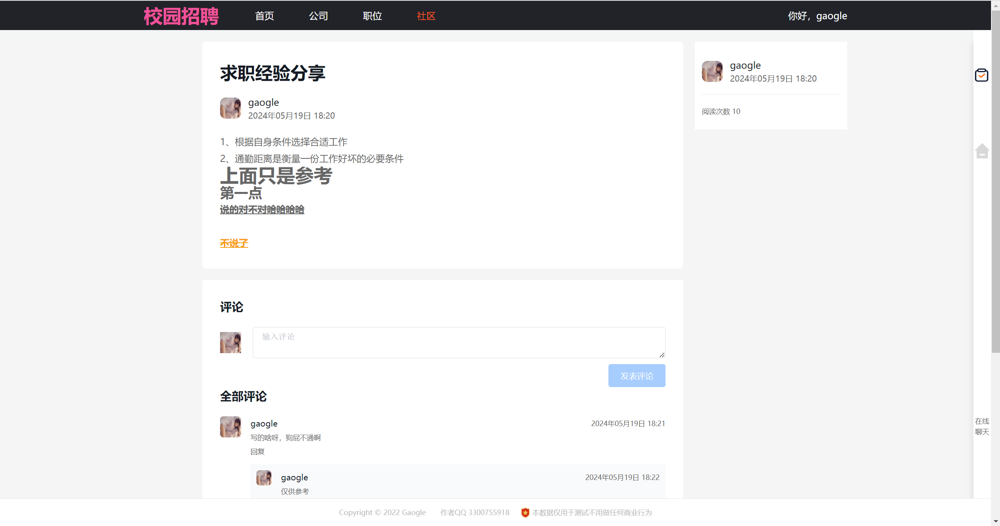

#   基于Spring Boot-Vue的校园招聘系统-社会招聘系统-招聘信息系统-前后端分离-代码设计与实现

### 软件技术架构
1. 后端: Spring Boot2.5.3、Mybatis
2. 前端：Vue2.0
3. 数据库：Mysql、Redis
4. 部署: Docker、Docker-compose

### 在线展示

1. [ **bilibili演示视频（B站）记得一赞三连哦！ :tw-1f60d:**  ](https://www.bilibili.com/video/BV1mU411Z7c6/?spm_id_from=333.999.0.0&vd_source=eac6949bd2385c66c0a975d5765c99a5)
2. [  :tw-25b6: **系统使用演示视频** ](https://www.bilibili.com/video/BV1mU411Z7c6/?spm_id_from=333.999.0.0&vd_source=eac6949bd2385c66c0a975d5765c99a5)

### 简介
校园招聘系统、社会招聘系统、招聘网站、发布招聘信息，

### 功能介绍

创建公司，公司信息维护，公司信息审核。
发布招聘信息，审核招聘信息，招聘职位管理。
投递信息管理，offer发放。 
文章锦集发布，文章评论回复。 
上传简历附件，预览简历。 
在线聊天界面，群聊经验分享。
用户管理，角色管理。

### 使用说明
1. 本项目开源免费，可以自行拉取代码，项目启动运行若有疑问可以联系作者咨询
2. 本代码存在许多不足，欢迎大佬提交代码合并请求
3.  :tw-1f232: **本代码严禁自行售卖，从事任何商业行为，谢谢合作**
4.  :tw-1f234: **若有侵权信息请联系作者删除，您的点赞收藏是我们前进的动力**
5.  :tw-1f46c: **作者QQ：3300755918**

### 功能详情图

[  :tw-25b6: **系统使用演示视频** ](https://www.bilibili.com/video/BV1mU411Z7c6/?spm_id_from=333.999.0.0&vd_source=eac6949bd2385c66c0a975d5765c99a5)

[  :tw-25b6: **系统使用演示视频** ](https://www.bilibili.com/video/BV1mU411Z7c6/?spm_id_from=333.999.0.0&vd_source=eac6949bd2385c66c0a975d5765c99a5)
